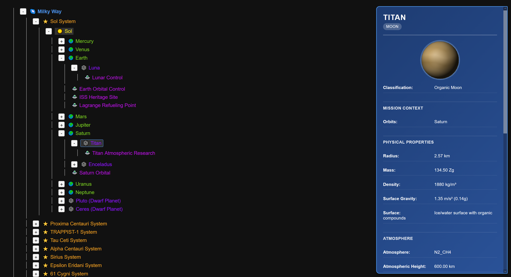
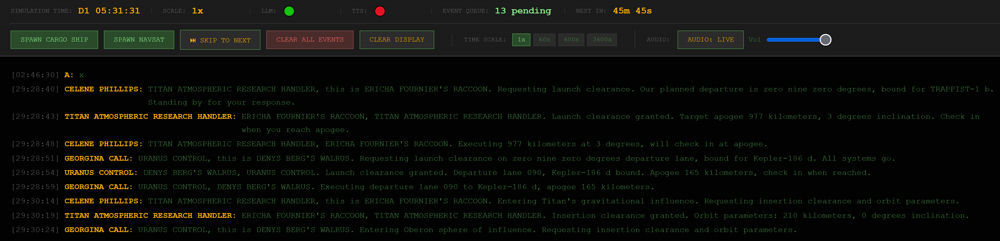

# Solar

[](https://dl.circleci.com/status-badge/redirect/gh/Jurph/solar/tree/main)
[](https://codecov.io/gh/Jurph/solar)

A space traffic control simulation that generates ships, routes them across a procedural solar system, and has them talk to each other like air traffic control (ATC) radio - complete with text to speech (TTS) voices, Quindar tones, room tone, and modem bursts.

> *The comm chirps a friendly tone and a welcoming voice says "Commercial tanker PULP NOVELLA, this is Titan Control, please acknowledge."*

The goal is something you can leave running in the background like a radio - ships checking in, controllers clearing maneuvers, satellites broadcasting navigation updates. The simulation runs on physics-based timing, the dialogue is LLM-generated, and the audio is synthesized locally.

---

## Screenshots

**Universe browser** — explore the celestial hierarchy, select any body to see its physical properties:



**Event scroller** — live ATC-style dialogue scrolling in simulation time with audio:



---

## What works today

- Ships spawn with procedurally generated names, pilots, and cargo
- Routes are planned using orbital mechanics (launch, circularize, transfer, insertion, landing)
- Dialogue is generated by a local LLM using ATC-style scripts as scaffolding
- TTS audio is pre-rendered per-character with Quindar tones, room tone, and modem noise mixed in
- A scrolling event display shows dialogue as it unfolds in simulation time
- Simulation time can be scaled (1x to 3600x) or skipped to the next event
- Navigation satellite broadcasts with modem-encoded data bursts

---

## Requirements

For the full experience you want:

1. **Python 3.10+**
2. **An OpenAI-compatible LLM endpoint**
3. **A local GPU with CUDA** for TTS (`chatterbox-tts` runs on-device)

Ollama is the easiest local LLM option, but it is not required. Solar talks to an OpenAI-compatible API, so you can point it at whatever you already use.

> **GPU note:** on smaller cards, the LLM and TTS may compete for VRAM. If mission spawning starts failing while the audio worker is running, stop the worker, generate the mission, then start the worker again.

---

## Quick start

The easiest way to run the project is to use the launch scripts:

- **Windows:** `launch-django.bat`
- **Linux/macOS:** `./launch-django.sh`

Those scripts handle the virtual environment, migrations, and Django startup. They also try to start Ollama if it is installed.

If you prefer to do things manually, use the install steps below.

## Install

Dependencies for this project are defined in `pyproject.toml`.

If you are using `uv`:

```bash
uv sync --extra dev
```

If you are using `pip`:

First create a virtual environment:

```bash
python -m venv .venv
```

Then activate it:

```bash
# Linux/macOS
source .venv/bin/activate

# Windows (PowerShell)
.venv\Scripts\Activate.ps1

# Windows (cmd.exe)
.venv\Scripts\activate
```

Then install the project and development dependencies:

```bash
pip install -e .[dev]
```

If you want the full TTS experience or plan to run the slow GPU-backed tests, add the optional ML dependencies as well:

```bash
uv sync --extra dev --extra ml
pip install -e .[dev,ml]
```

<a href="https://hatch.pypa.io/1.13/config/metadata/">Hatch</a>,
<a href="https://pdm-project.org/en/latest/reference/pep621/">PDM</a>, and
<a href="https://python-poetry.org/docs/pyproject/">Poetry</a>
also support `pyproject.toml` natively.
If you prefer
<a href="https://docs.conda.io/projects/conda/en/25.5.x/user-guide/tasks/manage-environments.html">conda</a>,
you may need a few additional setup steps.

After installation:

1. Run migrations.
```bash
cd mysite
python manage.py migrate
```

2. Start an LLM endpoint if you want dialogue generation.
```bash
ollama serve
```

3. Start Django.
```bash
python manage.py runserver
```

4. Optionally start the audio worker if you want pre-generated TTS audio.
```bash
python manage.py audio_worker
```

You do **not** need to start everything at once just to poke around. If you only want to browse the universe or inspect the UI, Django by itself is enough. The audio worker is only needed for the fully rendered comms experience.

---

## Running

Once Django is running, open a browser to one of these:

| Page | URL | What it does |
|---|---|---|
| Event scroller | `http://127.0.0.1:8000/events/` | Main UI - live dialogue with audio |
| Universe browser | `http://127.0.0.1:8000/universe/` | Explore the celestial hierarchy |
| Audio lab | `http://127.0.0.1:8000/audio-lab/` | Test audio synthesis |
| Admin | `http://127.0.0.1:8000/admin/` | Django admin (mostly for debugging) |

---

## LLM setup

Solar uses any OpenAI-compatible endpoint. The default (in `llm_service.py`) assumes Ollama at `localhost:11434`.

```bash
ollama pull qwen2.5:1.5b    # recommended balance of speed and quality
ollama serve
```

A smaller model like `qwen2.5:0.5b` works but produces noticeably weaker dialogue. `llama3` is better still if you have the VRAM. You can point Solar at a remote API (OpenAI, Anthropic via proxy, etc.) by editing the `llm_service.py` file.

---

## Tech stack

| Layer | Technology | Notes |
|---|---|---|
| Web framework | Django 5 | Models, views, routing, admin, ORM |
| Database | SQLite | Default; stores universe, actors, events |
| World model | Django ORM + XML | Celestial hierarchy, ships, stations |
| Navigation | networkx + custom services | Route planning, orbital mechanics |
| Dialogue | LLM via OpenAI-compatible API | ATC-style dialogue generation |
| LLM (local option) | Ollama | Easiest way to run a local model |
| TTS | Chatterbox-Turbo | Local GPU inference, character voices |
| Audio mixing | Custom pipeline | Quindars, room tone, modem noise |
| Audio pre-generation | Django management command (`audio_worker`) | Renders audio 1hr ahead of playback |
| Frontend | Django templates + vanilla JS | No framework |
| Testing | pytest + pytest-django |  |
| CI / coverage | CircleCI + Codecov | Fast test suite split across 4 parallel workers on every push |

---

## Architecture in brief

1. **XML + procedural generation** populates the universe with stars, planets, stations, actors
2. **`spawn_mission`** creates a ship, plans a physics-based route, generates dialogue events
3. **`audio_worker`** (background process) pre-renders TTS audio one hour ahead
4. **`event_feed`** API returns events as simulation time reaches their timestamps
5. **`/events/`** UI polls the feed, queues audio, and plays each event when audio is ready
6. The web server never generates audio on demand - it only serves what the worker has rendered

More detail in [`docs/ARCHITECTURE.md`](docs/ARCHITECTURE.md),
[`docs/audio_worker_design.md`](docs/audio_worker_design.md), and
[`docs/EVENT_SCROLLER_STATE_MACHINE.md`](docs/EVENT_SCROLLER_STATE_MACHINE.md).

---

## Tests

```bash
pytest -m "not slow and not external"  # fast project-local tests used by CI
pytest -m external                     # local LLM/TTS/Ollama/hardware checks
pytest                                # everything
```

External tests require local services or hardware such as Ollama, a GPU, or optional ML dependencies. The CI pipeline runs the fast suite only, split across parallel CircleCI workers. See [`docs/TESTING.md`](docs/TESTING.md) for marker policy and test quality expectations.

Code review expectations are documented in [`docs/CODING_STANDARDS.md`](docs/CODING_STANDARDS.md).

---

## Further reading

- [`docs/TODO.md`](docs/TODO.md) - roadmap and feature backlog
- [`Bibliography/`](bibliography/) - peer-reviewed papers that shaped our procedurally generated galaxy 
- [`docs/CI_CD_SETUP.md`](docs/CI_CD_SETUP.md) - CI and Codecov setup
