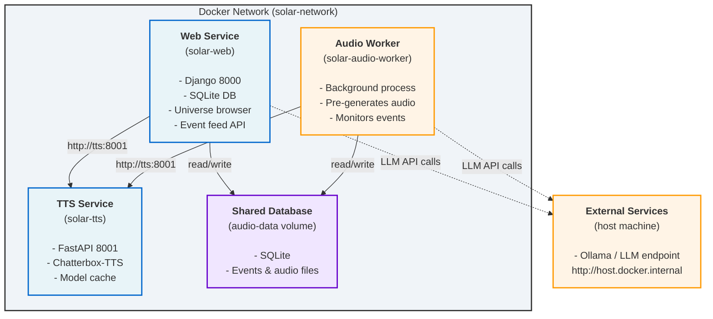

# Solar Docker Setup Guide

This document describes how to run the Solar space traffic control simulation in Docker containers.

## Architecture Overview

Solar uses a **multi-container architecture** with three services:



### Key Features

1. **Separate Services**: Web, TTS, and Audio Worker run independently
2. **Background Audio Generation**: Audio Worker pre-generates audio continuously
3. **Internal Docker Network**: Services communicate via internal bridge
4. **Persistent Caching**: Model cache and database survive restarts
5. **Health Checks**: All services monitored with status indicators
6. **Non-root Users**: Security hardening
7. **Scalable**: Services can be scaled independently

## Quick Start

### 1. Prepare Environment

```bash
cd solar
cp .env.example .env
```

Edit `.env` to configure services:

```bash
# Django settings
DJANGO_DEBUG=True
SECRET_KEY=your-secret-key-change-in-production
ALLOWED_HOSTS=localhost,127.0.0.1

# LLM endpoint (external, on host machine)
LLM_ENDPOINT=http://host.docker.internal:11434/v1
LLM_MODEL=qwen2.5:1.5b

# TTS settings (internal Docker network)
TTS_DEVICE=cuda  # or 'cpu' if no GPU
TTS_ENDPOINT=http://tts:8001/v1/audio
```

### 2. Start All Services

```bash
docker-compose up -d
```

This starts:
- `solar-web` (Django) on port 8000
- `solar-tts` (Chatterbox-TTS) on port 8001
- `solar-audio-worker` (Background audio generation)

### 3. Access the Application

```bash
# Universe browser
http://localhost:8000/universe/

# Event scroller (main UI)
http://localhost:8000/events/

# Admin panel
http://localhost:8000/admin/

# TTS health check
http://localhost:8001/health
```

## Environment Variables

### Django Configuration

| Variable | Description | Default |
|----------|-------------|---------|
| `DJANGO_DEBUG` | Enable debug mode | `True` |
| `SECRET_KEY` | Django secret key (CHANGE IN PRODUCTION) | `django-insecure-...` |
| `ALLOWED_HOSTS` | Comma-separated allowed hosts | `localhost,127.0.0.1` |
| `DJANGO_DATABASE_PATH` | SQLite database path | `/app/db.sqlite3` |

### LLM Configuration (External Service)

| Variable | Description | Default |
|----------|-------------|---------|
| `LLM_ENDPOINT` | OpenAI-compatible API URL | `http://host.docker.internal:11434/v1` |
| `LLM_API_KEY` | LLM API key if needed | (none) |
| `LLM_MODEL` | Model name for calls | `qwen2.5:1.5b` |
| `LLM_MAX_TOKENS` | Max tokens per response | `500` |

### TTS Configuration (Internal Docker Service)

| Variable | Description | Default |
|----------|-------------|---------|
| `TTS_ENDPOINT` | TTS service URL | `http://tts:8001/v1/audio` |
| `TTS_DEVICE` | GPU/CPU for inference | `cuda` |
| `TTS_PRE_RENDER_ENABLED` | Enable audio pre-generation | `False` |
| `CHATTERBOX_LOCAL_PATH` | Model cache location | `/app/models/chatterbox-turbo` |

### Universe & Simulation

| Variable | Description | Default |
|----------|-------------|---------|
| `UNIVERSE_XML_PATH` | Universe XML file | `xml/milkyway-v005.xml` |
| `SIMULATION_TIME_SCALE` | Simulation speed multiplier | `1` |
| `LLM_SAFE_LATENCY_SECONDS` | LLM latency budget | `3.0` |

## External Services Setup

### Running Ollama (LLM)

The LLM service runs on your **host machine**, not in Docker:

```bash
# On host machine
ollama pull qwen2.5:1.5b
ollama serve
```

The web container connects via `http://host.docker.internal:11434/v1`.

### TTS Service (Now Built-In)

The TTS service now runs in its own Docker container (`solar-tts`). No external setup needed!

**First run**: Model downloads (~2GB) on startup. Subsequent runs use cached model.

To use GPU acceleration:
```bash
TTS_DEVICE=cuda docker-compose up -d
```

To use CPU (slower):
```bash
TTS_DEVICE=cpu docker-compose up -d
```

## Health Checks

All services have built-in health checks:

```bash
# Check web service
curl http://localhost:8000/api/simulation/health/

# Check TTS service
curl http://localhost:8001/health
```

## Troubleshooting

### Web service won't start

```bash
# Check logs
docker-compose logs web

# Verify database migrations ran
docker-compose exec web python mysite/manage.py migrate

# Check if port 8000 is in use
lsof -i :8000
```

### TTS service won't start

```bash
# Check logs
docker-compose logs tts

# Verify GPU availability (if using CUDA)
docker-compose exec tts nvidia-smi

# Try CPU mode if GPU fails
TTS_DEVICE=cpu docker-compose up -d tts
```

### TTS model download stuck

First TTS startup downloads ~2GB model. This takes 1-2 minutes:

```bash
# Monitor progress
docker-compose logs -f tts

# Wait for "TTS service initialized successfully" message
```

### Web can't reach TTS

```bash
# Verify TTS is running
docker-compose ps

# Check TTS health
curl http://localhost:8001/health

# Verify network connectivity
docker-compose exec web curl http://tts:8001/health
```

### LLM timeout errors

Increase timeout or use a faster model:

```bash
# Use smaller, faster model
export LLM_MODEL=qwen2.5:0.5b
docker-compose up -d
```

### Port already in use

```bash
# Find what's using the port
lsof -i :8000
lsof -i :8001

# Change ports in docker-compose.yml:
# ports:
#   - "8080:8000"  # Web on 8080
#   - "8081:8001"  # TTS on 8081
```

## Custom Universe Files

To use a custom universe definition:

```bash
# Add to docker-compose.yml volumes:
volumes:
  - ./my-universe.xml:/app/xml/custom.xml:ro
```

Then set in `.env`:
```bash
UNIVERSE_XML_PATH=xml/custom.xml
```

## Cleaning Up

```bash
# Stop containers
docker-compose down

# Remove volumes (deletes database and model cache)
docker-compose down -v

# Remove all including orphans
docker-compose down -v --remove-orphans

# Remove images
docker-compose down -v --rmi all
```

## Performance Tuning

### GPU Acceleration

For faster TTS generation, use GPU:

```bash
TTS_DEVICE=cuda docker-compose up -d
```

Requires NVIDIA GPU and `nvidia-docker`.

### Model Caching

Model cache persists in `tts-models` volume. First run downloads ~2GB, subsequent runs use cache.

To clear cache:
```bash
docker volume rm tts-models
```

### Database Optimization

For production, consider PostgreSQL instead of SQLite:

```bash
# Add to docker-compose.yml
postgres:
  image: postgres:15-alpine
  environment:
    POSTGRES_DB: solar
    POSTGRES_PASSWORD: changeme
  volumes:
    - postgres-data:/var/lib/postgresql/data
```

Then update Django settings to use PostgreSQL.
